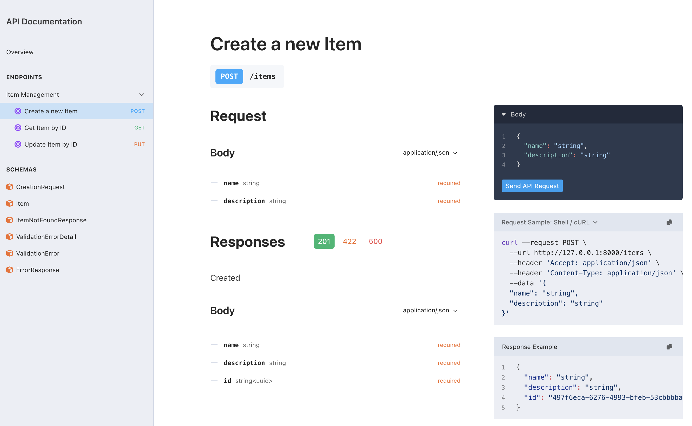

[](https://pypi.org/project/pydantic-tornado/)
[](https://pydantic-tornado.readthedocs.io/en/latest/?badge=latest)

[](https://sonarcloud.io/summary/overall?id=dave-shawley_pydantic-tornado)

> Another attempt to bring first-class Pydantic support to Tornado applications

The goal of this library is to provide a pythonic way to validate and serialize data in Tornado applications using
Pydantic models. A secondary, though very important, goal is to also automatically generate OpenAPI documentation
for a Tornado application. This library is heavily inspired by FastAPI and Pydantic, but is designed to work with
Tornado web applications. The difficulty in using Pydantic with Tornado is that Tornado exposes request data using
an instance attribute instead of a function parameter. Similarly, the response to is sent using a method call instead
of a return statement. This library uses a set of decorators and type annotations that implement request handlers
that take parameters and return values directly. I think that this is more pythonic and easier to understand.

Let's look at a simple example. Here is a Tornado request handler for a very simple REST API:

```python
import datetime
import json
from tornado import web

class ItemCreationHandler(web.RequestHandler):
    def post(self) -> None:
        data = json.loads(self.request.body)
        data['item_id'] = 42
        self.write(json.dumps(data))

class ItemHandler(web.RequestHandler):
    def get(self, item_id: int) -> None:
        self.write(json.dumps({'item_id': item_id, 'description': 'whatever'}))

    def put(self, item_id: int) -> None:
        data = json.loads(self.request.body)
        data['last_modified'] = datetime.datetime.now(datetime.UTC).isoformat()
        self.write(json.dumps(data))
```

Here is the same request handler using Pydantic and Pydantic-Tornado:

```python
import datetime
import pydantic
from pydantictornado import api
from tornado import web

class CreateItemRequest(pydantic.BaseModel):
    description: str

class Item(CreateItemRequest)
    item_id: int
    last_modified: datetime.datetime | None = None

class ItemCreationHandler(web.RequestHandler):
    @api.expose_operation(summary='Create a new item')
    async def post(self, item: CreateItemRequest) -> Item:
        item.item_id = 42
        return item

class ItemHandler(web.RequestHandler):
    @api.expose_operation(summary='Get item by ID')
    async def get(self, item_id: int) -> Item:
        return Item(item_id=item_id, description='whatever')

    @api.expose_operation(summary='Update item by ID')
    async def put(self, item_id: int) -> Item:
        item = Item(item_id=item_id, description='whatever')
        item.last_modified = datetime.datetime.now(datetime.UTC)
        return item
```

It is a little longer since we have to define Pydantic models that describe the request and response structures, but
the result is a typesafe application where the request and response types are clearly defined. The `expose_operation`
decorator wraps the request handler method and takes care of validating the request data, serializing the response,
and more.

The library also provides a way to automatically generate OpenAPI documentation for the application. Here is how you
add OpenAPI specification and document rendering endpoints to the application:

```python
from pydantictornado import handlers
from tornado import web

class Application(handlers.OpenAPIApplication):
    def __init__(self):
        super().__init__([
            web.URLSpec(r'/items', ItemCreationHandler),
            web.URLSpec(r'/items/(?P<item_id>\d+)', ItemHandler),
            web.URLSpec(r'/docs', handlers.OpenAPIDocHandler, {'spec_handler_name': 'openapi_spec'}),
            web.URLSpec(r'/openapi.json', handlers.OpenAPISpecHandler, name='openapi_spec'),
        ])
```

The OpenAPI documentation site looks something like the following. The generation of the specification and the
documentation itself are separated into two handlers. You can use the `OpenAPIDocHandler` to serve a documentation
site, provide your own, or use a different tool to render the specification. I use the Stoplight Elements tool to
render the API site by default.



## Installation

The library is available on PyPI and can be installed using pip or use whatever package management incantations you
are comformatle with.

```shell
python -m pip install pydantic-tornado  # for pip
uv add pydantic-tornado                 # for uv
poetry add pydantic-tornado             # for poetry
```

The library requires at least Python 3.12, Tornado 6.2, and Pydantic 2.

## Contributing

I chose to use [hatch](https://hatch.pypa.io/latest/) to manage this project, [pytest](https://pytest.org),
[ruff](https://astral.sh/ruff) for linting & formatting, [mypy[(https://mypy.readthedocs.io) for static type checking,
and [mkdocs](https://www.mkdocs.org/) to manage the documentation suite. Though I use pytest, I don't use any of the
test extensions (eg, fixtures) provided by the library. I prefer to use plain old unittest.TestCase classes and
only use `pytest` for its excellent runner.

If you decide to contribute to this project, start by [forking the repository](https://github.com/dave-shawley/pydantic-tornado/fork)
and cloning your fork to your local machine. You can then install the development dependencies using hatch:

```shell
python -m pip install --upgrade --user hatch
hatch run test  # ... activates virtual environment, syncs dependencies, and runs linter and tests
```

You can also spqwn a shell in the development environment using `hatch shell`. This is useful for running the linter
or tests manually. There are a number of other commands (hatch scripts) available:

* *hatch run serve-docs* - start a local server on port 8000 to view the documentation. This will also watch the
  documentation files for changes and rebuild the site automatically.
* *hatch run serve-examples* - start a local server on port 8000 to run the example application. This will also watch
  the example files for changes and restart the server automatically.
* *hatch run ci:test* - runs linter and tests in multiple Python versions using a matrix. This emulates a CI pipeline.

Once you contribution is ready, issue a pull request back to my repository and I will review it as soon as I can. Make
sure that you have tests and documentation for your changes. I will not *merge* any changes that do not have test coverage.
If you are having problems writing tests for your changes, submit a PR with the changes and I will help you write the tests.
That or take the opportunity to have GitHub Co-pilot or a similar AI assistant lend a hand.
